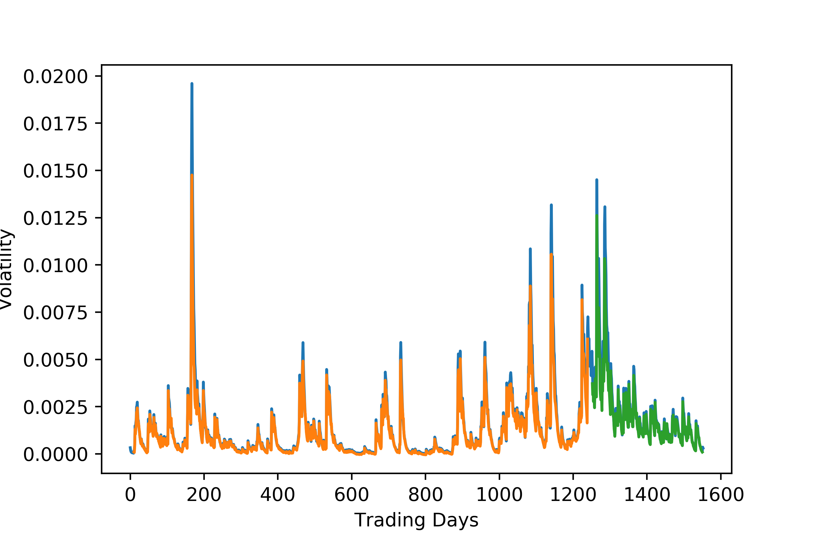

# Forecasting the CRIX Crypto Index Volatility with an LSTM Neural Network

A LSTM Model to forecast 1-day ahead smoothed (EWMA) volatility of the CRIX Index. The model uses a certain lookback as hyperparameter and is evaluated with the root mean squared error. This project was part of the course 'Smart Data Analytics' at the University of St. Gallen. November, 2018   
 
Collaborators:  
David Wiprächtiger  
Julian Schwarzen  
Cedric Müller  
Lukas Schreiner  
 
Data: 
http://thecrix.de/
 

  

 
To Do: Run different (smaller) model architectures and implement regularisation.
